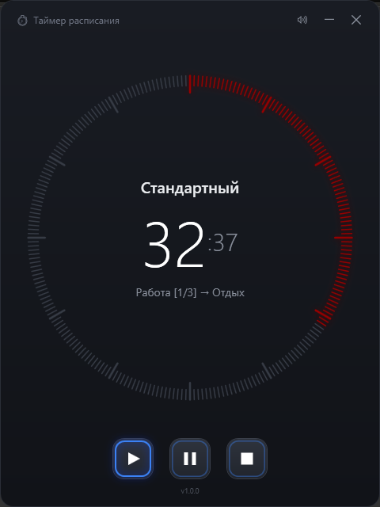

# Schedule Timer — a timer that runs your scenario

[Русская версия](README.ru.md)

A versatile schedule timer for Windows with a dial face and click-to-seek.
Build nested scenarios of any complexity (pomodoro, tabata and more) —
repeats, preparation countdowns. Add your own sounds for events.

Run the same timer for different projects — on stop you get time per period
and a total. No install, no accounts: an `exe` plus a single config file.

For focused work, workouts and anything that runs on a schedule.

## Documentation

- [User Guide](docs/user-guide.md) — features, hotkeys, configuration (`config.json`), examples. [По-русски](docs/user-guide.ru.md)
- [Technical Guide](docs/technical.md) — building from source, releases, MSIX, analytics. [По-русски](docs/technical.ru.md)
- [Changelog](CHANGELOG.md)

## License

[MIT](LICENSE.txt)
